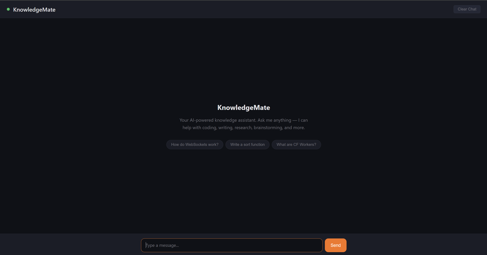

# cf*ai* KnowledgeMate

An AI-powered knowledge assistant built on Cloudflare's platform. Chat with Llama 3.3 70B through a real-time WebSocket interface, with full conversation memory powered by Durable Objects.



## Architecture

| Component        | Technology                                                     |
| ---------------- | -------------------------------------------------------------- |
| **LLM**          | Llama 3.3 70B (Workers AI)                                     |
| **Coordination** | Durable Objects via Agents SDK                                 |
| **User Input**   | WebSocket-based chat UI                                        |
| **State/Memory** | Durable Object state (conversation history persisted per user) |

### How It Works

1. **Frontend** (`public/index.html`) — A single-page chat interface using vanilla HTML/CSS/JS. Connects to the backend via WebSocket.
2. **Worker** (`src/server.ts`) — Routes incoming requests: WebSocket connections go to the Durable Object agent, static assets are served from `/public`.
3. **KnowledgeAgent** (Durable Object) — Extends the `Agent` class from the Agents SDK. Each user gets their own isolated instance with:
   - Persistent conversation history (kept in agent state)
   - Streaming LLM responses via Workers AI
   - Context window management (last 20 messages retained)
4. **Workers AI** — Calls `@cf/meta/llama-3.3-70b-instruct-fp8-fast` with streaming enabled for token-by-token responses.

### Data Flow

```txt
Browser ──WebSocket──> Worker ──route──> KnowledgeAgent (Durable Object)
                                              │
                                              ├─ Loads conversation history from state
                                              ├─ Calls Workers AI (Llama 3.3 streaming)
                                              ├─ Streams tokens back via WebSocket
                                              └─ Saves updated history to state
```

## Prerequisites

- [Node.js](https://nodejs.org/) v18+
- A [Cloudflare account](https://dash.cloudflare.com/sign-up) (free tier works)
- [Wrangler CLI](https://developers.cloudflare.com/workers/wrangler/) (`npm i -g wrangler`)

## Running Locally

```bash
# 1. Clone the repo
git clone <repo-url>
cd cf_ai_

# 2. Install dependencies
npm install

# 3. Login to Cloudflare (needed for Workers AI access)
wrangler login

# 4. Start the dev server
npm run dev
```

Open `http://localhost:8787` in your browser.

> **Note:** Workers AI requires authentication even in local dev. Run `wrangler login` first.

## Deploying to Cloudflare

```bash
npm run deploy
```

This deploys the Worker + Durable Object + static assets to your Cloudflare account. The deployed URL will be printed in the console.

## Project Structure

```txt
cf_ai_/
├── src/
│   └── server.ts          # Worker entry point + KnowledgeAgent Durable Object
├── public/
│   ├── index.html         # Chat UI (HTML/CSS/JS)
│   └── favicon.svg        # App icon
├── wrangler.jsonc         # Cloudflare Workers configuration
├── tsconfig.json          # TypeScript configuration
├── package.json           # Dependencies and scripts
├── README.md              # This file
└── PROMPTS.md             # AI prompts used during development
```

## Features

- **Real-time streaming** — Token-by-token response streaming via WebSocket
- **Conversation memory** — Full chat history persisted per user in Durable Object state
- **Per-user isolation** — Each user gets their own Durable Object instance (identified by UUID stored in localStorage)
- **Context management** — Automatically trims conversation to last 20 messages to stay within LLM context limits
- **Markdown rendering** — Responses rendered with code blocks, bold, italic, lists, and headers
- **Auto-reconnect** — WebSocket reconnects automatically on disconnect
- **Clear chat** — Reset conversation history with one click

## Tech Stack

- **Cloudflare Workers** — Serverless compute at the edge
- **Cloudflare Workers AI** — Managed LLM inference (Llama 3.3 70B)
- **Cloudflare Durable Objects** — Stateful coordination with the Agents SDK
- **Agents SDK** (`agents` npm package) — Framework for building stateful AI agents on Cloudflare
- **Vanilla HTML/CSS/JS** — Simple frontend with no build step
